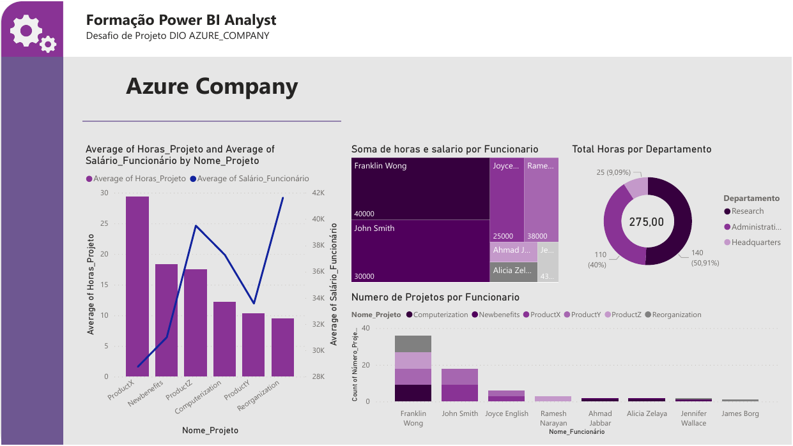

# dio-powerbi-azure-dashboard
Processando e Transformando Dados com Power BI

- Processamento de Dados Simplificado com Power BI

1. Criação de uma instância na Azure para MySQL

2. Criar o Banco de dados com base disponível no github

3. Integração do Power BI com MySQL no Azure

4. Verificar problemas na base a fim de realizar a transformação dos dados

